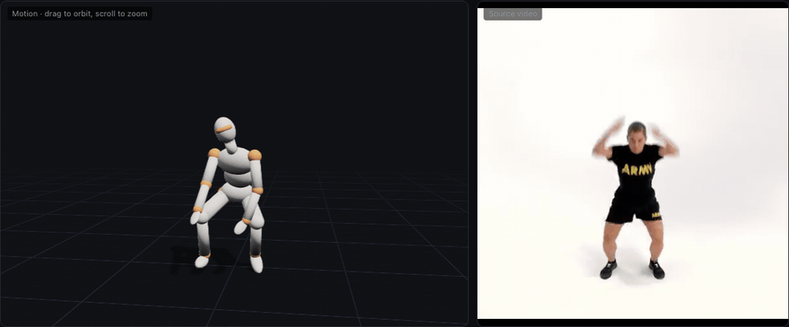
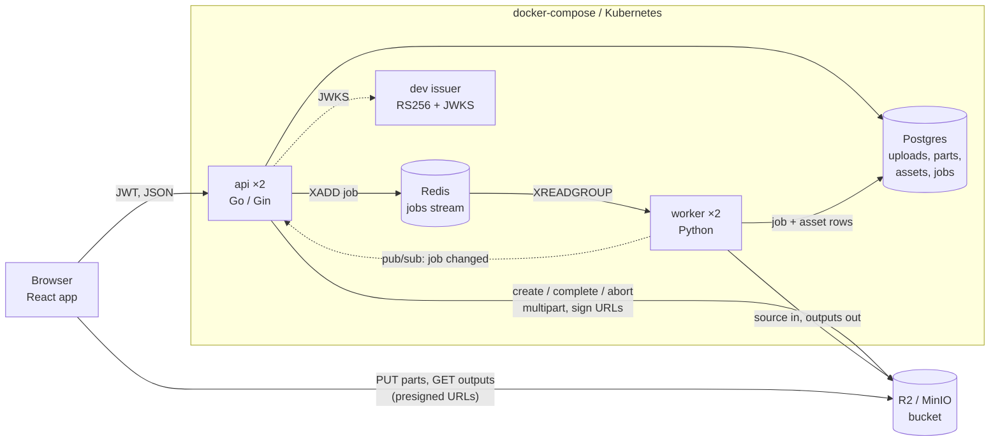
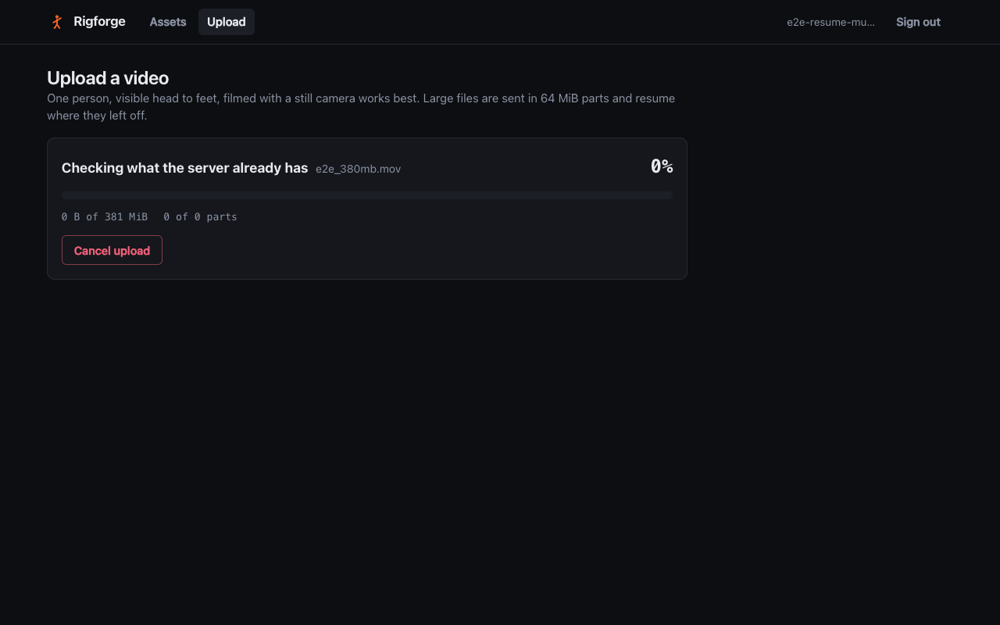
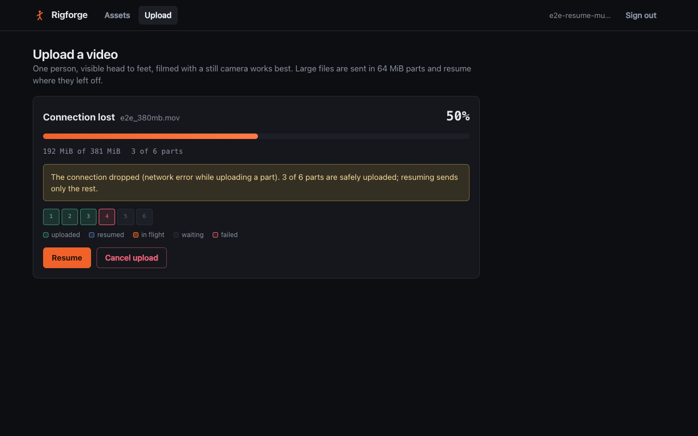
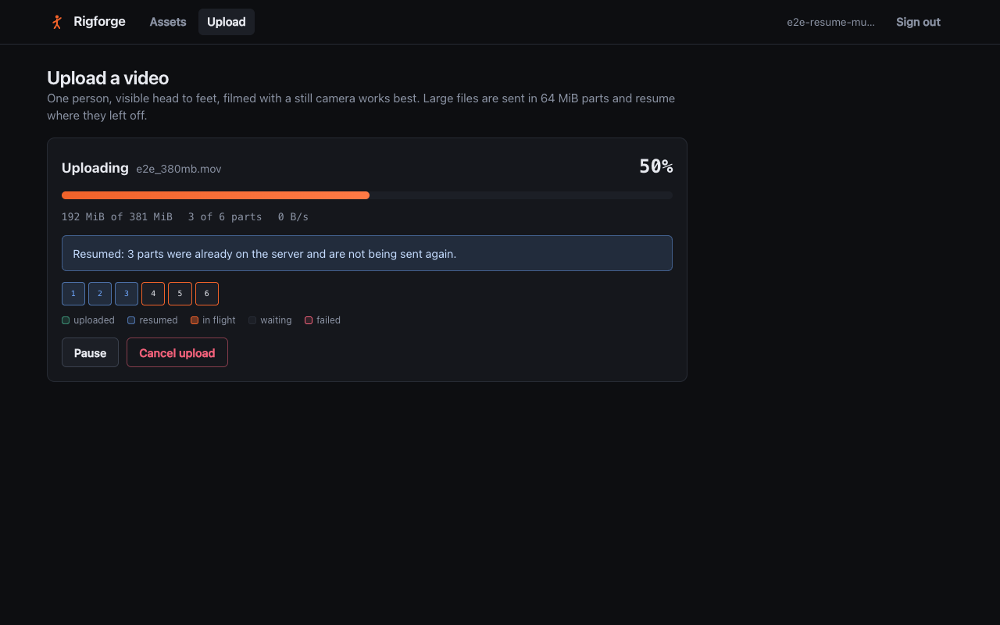
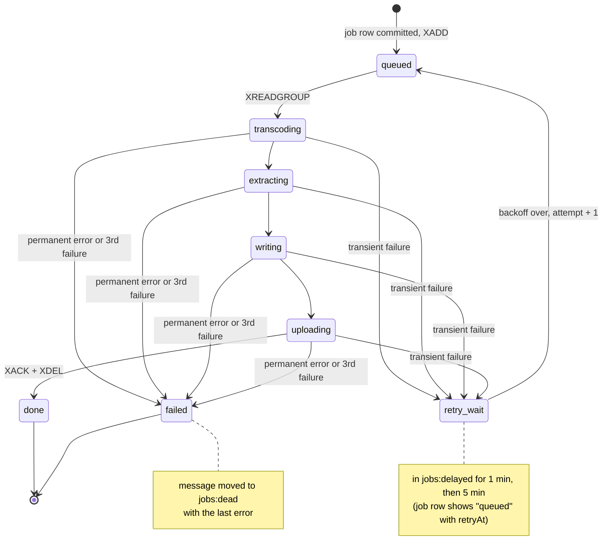
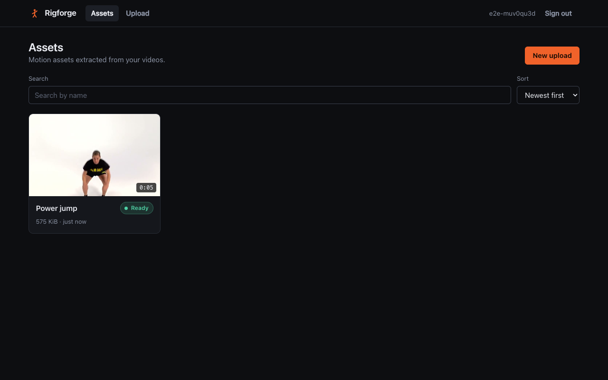
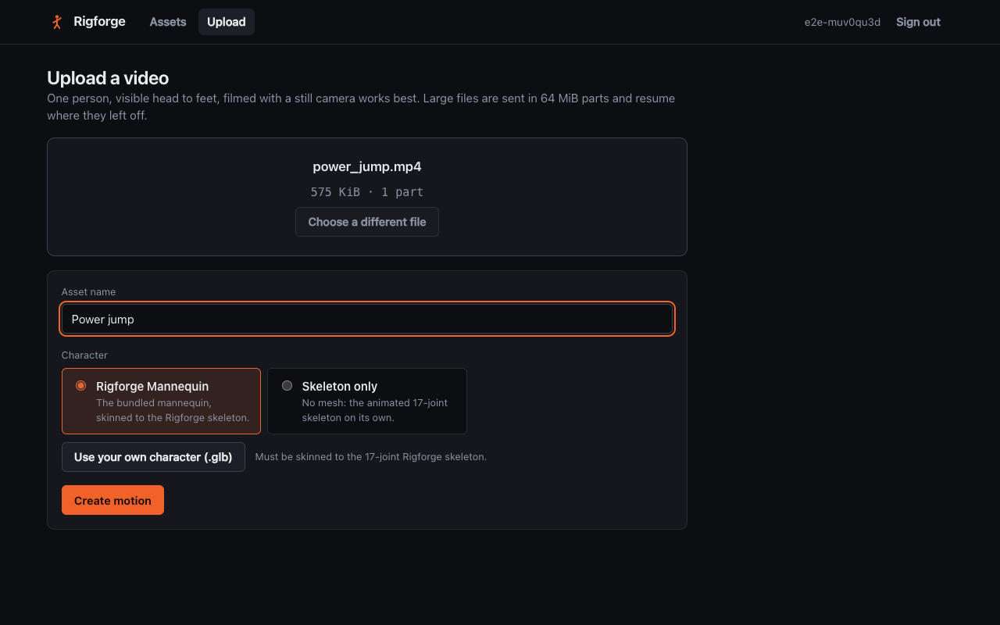
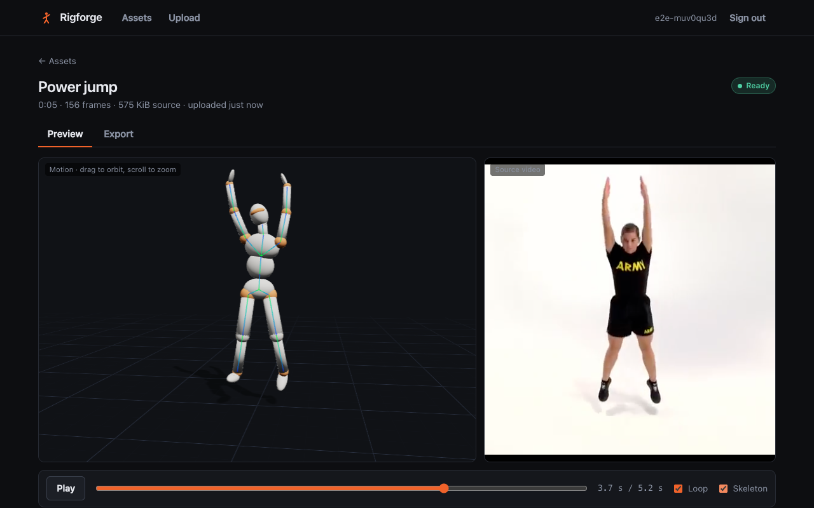

# Rigforge

[](https://github.com/ArianKhademi/rigforge/actions/workflows/ci.yml)

Upload a video of a person moving; get back a glTF motion asset you can preview on a character and export.

Rigforge is a small but complete pipeline: a Go / Gin api that takes multi-gigabyte uploads straight into S3-compatible storage (Cloudflare R2, or MinIO locally) through presigned URLs, Python workers on a Redis Streams job queue that transcode the video, extract the pose and retarget it onto a rigged skeleton, and a React / TypeScript app to upload, browse, preview and export the result. It runs on docker-compose and on Kubernetes.



*Left: `motion.glb` produced by the pipeline, playing in the browser on the bundled mannequin. Right: the source clip. Both are driven by one clock. Recorded from the running app by [`web/e2e/docs.spec.ts`](web/e2e/docs.spec.ts).*

**Stack:** Go 1.26, Gin, jwkit, PostgreSQL, Redis Streams, Python 3.11, ffmpeg, MediaPipe Pose Landmarker, React 18, TypeScript, react-three-fiber, Docker, Kubernetes (kind).

## Contents

- [Quick start](#quick-start)
- [Architecture](#architecture)
- [Resumable uploads](#resumable-uploads)
- [The job queue](#the-job-queue)
- [The video worker](#the-video-worker)
- [The web app](#the-web-app)
- [Kubernetes](#kubernetes)
- [Tests](#tests)
- [Measured numbers](#measured-numbers)
- [Limitations](#limitations)
- [Development notes](#development-notes)

## Quick start

Needs Docker. Everything else runs in containers.

```bash
git clone https://github.com/ArianKhademi/rigforge && cd rigforge
make dev            # build and start the whole stack
open http://localhost:8081
```

Sign in with any name (see [auth](#auth)), drop `docs/samples/power_jump.mp4` on the upload page and press **Create motion**.

| Command | What it does |
| --- | --- |
| `make dev` | the whole stack on docker-compose (web on :8081, api on :8080, MinIO on :9000) |
| `make test` | every unit and integration suite (starts Postgres, Redis and MinIO) |
| `make e2e` | Playwright against the full stack |
| `make resume-test` | the 2 GB resumable-upload test, [`scripts/upload_resume_test.sh`](scripts/upload_resume_test.sh) |
| `make deploy-kind` | create a local Kubernetes cluster and deploy everything to it |
| `make help` | the rest |

For native development (`make setup`, then run the api, worker and Vite dev server against `make infra`) see [docs/architecture.md](docs/architecture.md#running-natively).

## Architecture



The api never touches video bytes. It hands the browser presigned URLs, and the browser sends the file to the bucket itself; the api only keeps the bookkeeping (which parts exist) and completes the upload. The browser never holds bucket credentials.

### Request flow for an upload

```mermaid
sequenceDiagram
    participant B as Browser
    participant A as api
    participant S as Bucket (R2 / MinIO)
    participant Q as Redis
    participant W as Worker

    B->>A: POST /api/uploads {filename, size, contentType}
    A->>S: CreateMultipartUpload
    A-->>B: {uploadId, partSize: 64 MiB, partCount}
    loop 4 parts at a time
        B->>A: POST /api/uploads/{id}/parts {partNumbers}
        A-->>B: presigned PUT URLs (15 min)
        B->>S: PUT part bytes
        S-->>B: ETag
        B->>A: PUT /api/uploads/{id}/parts/{n} {etag}
    end
    Note over B,A: after a crash or reload: POST /api/uploads/{id}/reconcile<br/>returns the parts the server has; only the rest are sent
    B->>A: POST /api/uploads/{id}/complete {characterId}
    A->>S: CompleteMultipartUpload, then HeadObject (verify size)
    A->>A: one transaction: upload completed, asset row, job row
    A->>Q: XADD jobs {jobId, assetId, type, attempt}
    A-->>B: {assetId, jobId}
    Q->>W: XREADGROUP
    W->>S: download source, upload motion.glb / .bvh / preview / poster
    B->>A: GET /api/jobs/{id}/events (SSE) until done
```

More detail on every component, the data model and the reasoning behind the choices: [docs/architecture.md](docs/architecture.md).

### Auth

Every `/api/*` route except `/api/health` requires an RS256 JWT. Verification is done by [jwkit](https://github.com/ArianKhademi/jwkit), the owner's own JWT library: it fetches the issuer's JWKS (cached, refetched with a rate limit when a token names an unknown key id), allows only RS256/ES256 rather than trusting the token's `alg` header, binds each key to one algorithm, and checks issuer, audience and expiry in a fixed order. A rejected request gets a 401 whose `WWW-Authenticate` header names the failed check (`ErrExpired`, `ErrBadSignature`, ...) while the body stays generic. The user is the `sub` claim and every upload, asset, job and character is scoped to it; someone else's id is a 404, not a 403.

Tokens come from a tiny dev issuer in this repo ([`api/cmd/issuer`](api/cmd/issuer/main.go)) so the verification path is real without an external identity provider. It signs a token for any name it is given, so it is for demos only: point `JWT_JWKS_URL`, `JWT_ISSUER` and `JWT_AUDIENCE` at a real IdP to replace it.

## Resumable uploads

Files are cut into 64 MiB parts (R2 requires equal parts except the last, minimum 5 MiB). The client uploads four parts at a time with per-part retry and backoff, reports each part's ETag, and persists the upload id so that a reload, a crash or a dropped connection resumes instead of starting over.

What makes it resumable is that the **server's part list is the source of truth**. On resume the client calls `POST /api/uploads/{id}/reconcile`. The api asks the bucket which parts it actually holds, adopts any that arrived but were never reported (the client died between the PUT and the ETag report), and returns the list. The client sends only what is missing. Local storage remembers nothing but the upload id.

Other details worth knowing:

- `complete` is idempotent: a retry after a lost response returns the same asset and job. If the bucket completed but the database write did not, the retry notices and carries on.
- After completing, the api `HEAD`s the object and compares its size to the size the client declared.
- A reaper aborts uploads idle for 24 hours, so unfinished parts do not sit in the bucket (and on the bill) forever.
- The engine ([`web/src/upload/`](web/src/upload/)) has no browser dependencies. The web app runs it with a `File`, XHR and `localStorage`; the CLI ([`web/scripts/upload-cli.ts`](web/scripts/upload-cli.ts)) runs the same class with a file on disk, `fetch` and a JSON file.

### The 2 GB test

[`scripts/upload_resume_test.sh`](scripts/upload_resume_test.sh) generates a 2.1 GiB video, starts uploading it, kills the client with `SIGKILL` at about half way, restarts it, and then checks **from the bucket's own part list** (ETag and LastModified per part, before and after) that nothing was sent twice. The log of the run on this repo, [`docs/upload_resume_test.log`](docs/upload_resume_test.log):

```text
file:    tmp/resume-test/big_2254857830.mov
size:    2255235452 bytes (2.100 GiB, 2.255 GB)

-- run 1: upload, to be killed at ~50% --
plan:    34 parts of 67108864 bytes (64 MiB), last part 40642940 bytes
sent SIGKILL to the client (pid 91258) when the server had recorded 19 of 34 parts
client exit status: 137 (killed by signal 9); no client process left
  PUTs the client had finished:        19 parts
  PUTs in flight when it was killed:   [20,21,22,23]
bucket part list before restart: 19 of 34 parts, 1275068416 bytes (19 recorded by the api)

-- run 2: restart the client --
  parts found on the server and skipped: [1,2,3,4,5,6,7,8,9,10,11,12,13,14,15,16,17,18,19]
  parts PUT by run 2:                    [20,21,22,23,24,25,26,27,28,29,30,31,32,33,34]
bucket part list after restart:  34 of 34 parts, 2255235452 bytes

-- checks --
parts completed before the kill:              19
of those, re-sent after the restart:          0  []
parts whose ETag or LastModified changed:     0  []
parts missing before the restart:             15
parts sent after the restart:                 15
bytes in the bucket vs file size:             2255235452 = 2255235452
part ETag = MD5 of the file's bytes:          34 of 34 match

RESULT: PASS
```

The same test against the Kubernetes deployment: [`docs/upload_resume_test_kind.log`](docs/upload_resume_test_kind.log) (20 parts before the kill, 0 re-sent, 14 sent after).

> **Storage used for these runs: MinIO**, through the same S3 client code and configuration path as R2. The test has not been run against a real Cloudflare R2 bucket yet, because that needs account credentials. [docs/r2-setup.md](docs/r2-setup.md) walks through creating the bucket and token; then `make dev-r2` and `make resume-test`. On R2 the last check (ETag = MD5) is skipped automatically if R2's part ETags are not MD5s.

### In the browser

The same thing with a 380 MiB, six-part file, recorded by the Playwright test [`web/e2e/resume.spec.ts`](web/e2e/resume.spec.ts). The test cuts the connection for parts 4 to 6 and asserts that after resuming exactly those three parts reach the bucket.

| 1. Uploading | 2. Connection cut | 3. Resumed |
| --- | --- | --- |
|  |  |  |

The part list from the api at step 2 (`GET /api/uploads/{id}?storage=true`), saved by the test as [`docs/screenshots/resume-part-list.json`](docs/screenshots/resume-part-list.json): `parts` is what the api recorded, `storageParts` is what the bucket reports.

```json
{
  "status": "uploading",
  "partSize": 67108864,
  "partCount": 6,
  "parts": [
    { "partNumber": 1, "etag": "…", "recordedAt": "…" },
    { "partNumber": 2, "etag": "…", "recordedAt": "…" },
    { "partNumber": 3, "etag": "…", "recordedAt": "…" }
  ],
  "storageParts": [
    { "partNumber": 1, "etag": "…", "size": 67108864, "lastModified": "…" },
    { "partNumber": 2, "etag": "…", "size": 67108864, "lastModified": "…" },
    { "partNumber": 3, "etag": "…", "size": 67108864, "lastModified": "…" }
  ]
}
```

A second test reloads the page mid-upload, picks the same file again and checks that the upload continues from the server's part list.

## The job queue

Jobs go on a Redis stream, `jobs`, read by the consumer group `workers`. Redis Streams rather than Celery or RQ, because a consumer group already tracks who owns each message and for how long, and the rest (retries, backoff, dead-lettering, reclaiming) is about 250 lines in [`worker/rigforge_worker/queue.py`](worker/rigforge_worker/queue.py) that can be read top to bottom.



| Key | Type | Purpose |
| --- | --- | --- |
| `jobs` | stream | outstanding jobs: `{jobId, assetId, type, attempt}` |
| `workers` | consumer group | ownership and the pending-entries list |
| `jobs:delayed` | sorted set | retries waiting out their backoff, scored by due time |
| `jobs:dead` | stream | jobs that will not be retried, with the last error |

- **Retries.** A failed attempt is re-enqueued as `attempt + 1` after a backoff from the schedule 1 min, 5 min, 15 min. A job is dead-lettered after 3 failed attempts, so with the default limit the 1 and 5 minute delays are the ones used; the third applies if `JOB_MAX_ATTEMPTS` is raised. Scheduling the retry and removing the failed delivery happen in one `MULTI`; moving a due retry back onto the stream is a Lua script, so several workers can promote concurrently without doubling a job.
- **Permanent errors** (not a video, no person in frame, unknown character) skip the retries and go straight to `jobs:dead`. Retrying cannot fix the input.
- **Crashed workers.** A worker heartbeats its message every 15 s. If it dies, the message stays pending; once it has been idle for the visibility timeout (60 s) another worker takes it over with `XAUTOCLAIM`. A message that keeps killing workers is dead-lettered after 5 deliveries.
- **Idempotency.** Delivery is at-least-once. Outputs go to fixed keys under `assets/{assetId}/`, and the worker checks the job row before starting, so a duplicate delivery overwrites the same files or is acknowledged without work.
- **Stranded jobs.** The job row is committed before the `XADD`. If the api dies in between, a dispatcher loop finds queued rows with no `enqueued_at` and enqueues them.
- **Progress.** The worker writes status and percent to the job row and publishes a pub/sub nudge; the api's SSE endpoint re-reads the row and forwards it. Postgres stays the single source of truth, and any api replica can serve any stream.

Both failure paths, for real, on the Kubernetes deployment ([`scripts/retry_demo.sh`](scripts/retry_demo.sh), transcript in [`docs/retry_demo.log`](docs/retry_demo.log)). Object storage is scaled to zero while a job starts; the job fails, waits its minute, and succeeds on attempt 2. Then a video with nobody in it is dead-lettered on attempt 1:

```text
-- A. transient failure: storage disappears, the job is retried and recovers --
  t+  1s  status=transcoding attempt=1/3 retryAt=- error=-
  (storage restored: scaling MinIO back to 1)
  t+ 17s  status=queued attempt=2/3 retryAt=2026-10-05T09:09:21.788334Z error=EndpointConnectionError: Could not connect to the endpoint URL: …
  t+ 77s  status=transcoding attempt=2/3 retryAt=- error=EndpointConnectionError: …
  t+ 86s  status=done attempt=2/3 retryAt=- error=-

-- B. permanent failure: a video with nobody in it goes to the dead-letter stream --
  t+  3s  status=failed attempt=1/3 retryAt=- error=no person was detected for most of the video (only 5 of 60 frames); …
dead-letter stream: XLEN jobs:dead went from 0 to 1
```

## The video worker

Per job ([`worker/rigforge_worker/pipeline.py`](worker/rigforge_worker/pipeline.py)):

1. **Download** the source from the bucket to a temp dir, streamed to disk.
2. **Transcode** with ffmpeg in one pass: a working copy (H.264, constant 30 fps, short side at most 720 px) and a 480 px preview with the moov atom up front, then a poster frame.
3. **Extract the pose** with MediaPipe Pose Landmarker in video mode: 33 world landmarks per frame, read from an ffmpeg pipe one frame at a time. Gaps shorter than 10 frames are interpolated; longer ones are recorded and the pose is held. The track is smoothed with a One Euro filter run forwards and backwards, which cancels the lag.
4. **Retarget** the landmarks onto the 17-joint Rigforge skeleton ([`worker/rig/rigforge_skeleton.json`](worker/rig/rigforge_skeleton.json)). All of the maths is in [`worker/rigforge_worker/retarget.py`](worker/rigforge_worker/retarget.py):
   - every joint gets a world-space *delta* rotation from its bind pose (identity in the T-pose);
   - the torso comes from full frames built from the hip and shoulder lines, limbs from the shortest-arc swing of the parent's rotation onto the observed bone direction;
   - local rotations follow as `inverse(world[parent]) * world[joint]`, which also handles characters whose bones have their own axes (anything exported from Blender);
   - a tilted camera is estimated from the frames where the performer stands tall and rotated out;
   - root motion: sideways travel from the hips in the image, height from the feet in the image, and the rest from the character's own leg pose so that planted feet stay on the floor.
5. **Write** `motion.glb` with a hand-written glTF 2.0 writer ([`gltf.py`](worker/rigforge_worker/gltf.py)): skeleton nodes, skin, one animation with a rotation sampler per joint and a hips translation sampler, and the character mesh when one was selected. Also `motion.bvh`.
6. **Upload** `motion.glb`, `motion.bvh`, `preview.mp4`, `poster.jpg` to `assets/{assetId}/`.

**Characters.** The default is a mannequin generated by a Blender Python script, [`worker/rig/make_default_character.py`](worker/rig/make_default_character.py), so its origin is reproducible and its licence is not in question. Users can upload their own GLB; the api accepts it only if its skin has exactly the 17 Rigforge joints with the right parents and a mesh bound to them, and says precisely what is wrong otherwise. A "skeleton only" option produces the animated skeleton without a mesh.

**Sample.** Input: [`docs/samples/power_jump.mp4`](docs/samples/power_jump.mp4), 5.2 s of a public-domain U.S. Army fitness clip ([source and licence](docs/samples/README.md)). Output, exactly as the pipeline wrote it: [`docs/samples/output/`](docs/samples/output/) (`motion.glb`, `motion.bvh`, `preview.mp4`, `poster.jpg`). The GIF at the top of this page shows the two side by side.

## The web app

| Browse | Upload |
| --- | --- |
|  |  |

| Preview (skeleton shown) | Export |
| --- | --- |
|  |  |

- **Upload:** drag and drop, character picker (built-in or your own GLB), per-part and overall progress, pause, resume, cancel.
- **Browse:** the user's assets with poster, duration, status badge, retry count and the error text of failed jobs; search and sort on the server.
- **Preview:** `motion.glb` in a react-three-fiber scene with orbit controls, next to the source preview video. One clock drives both (the video is the master when it can play); play, pause, scrub, loop, skeleton overlay.
- **Export:** `motion.glb` and `motion.bvh` through presigned GET URLs that live for two minutes; re-run the job with another character; delete.

Job progress arrives over server-sent events, read with `fetch` so the token goes in a header rather than the URL. The layout holds at 390 px wide.

## Kubernetes

```bash
make deploy-kind      # about two minutes; prints http://localhost:8880
scripts/smoke_test.sh # pushes the sample clip through the deployment with curl
make kind-down
```

[`scripts/deploy_kind.sh`](scripts/deploy_kind.sh) creates a [kind](https://kind.sigs.k8s.io) cluster, builds the four images and loads them into it, generates throwaway secrets, applies [`deploy/k8s/overlays/kind`](deploy/k8s/overlays/kind) and waits for the rollout. Output from that deployment ([`docs/kind-get-pods.txt`](docs/kind-get-pods.txt)):

```text
$ kubectl get pods -n rigforge
NAME                       READY   STATUS    RESTARTS   AGE
api-698848985d-9z2gx       1/1     Running   0          2m33s
api-698848985d-h8gdk       1/1     Running   0          2m33s
issuer-d65949fcc-r4hr8     1/1     Running   0          2m33s
minio-5cdd5d699b-w2kdl     1/1     Running   0          2m33s
postgres-0                 1/1     Running   0          2m33s
redis-56b67dcb96-pp74g     1/1     Running   0          2m33s
traefik-858678c76c-zpcn8   1/1     Running   0          2m33s
web-5c6c8c5855-bqz8b       1/1     Running   0          2m33s
web-5c6c8c5855-h5ckl       1/1     Running   0          2m33s
worker-6fbbfcb9f-crftm     1/1     Running   0          2m33s
worker-6fbbfcb9f-rvjd9     1/1     Running   0          2m33s
```

If port 8880 or 9900 is taken on your machine, choose others when creating the cluster: `RIGFORGE_HTTP_PORT=8881 RIGFORGE_S3_PORT=9901 make deploy-kind`.

What is in the manifests ([`deploy/k8s/base`](deploy/k8s/base)):

- **api** ×2 and **worker** ×2 as separate Deployments, so they scale independently. Workers share one consumer group, so adding replicas adds throughput with no coordination.
- **Postgres** as a StatefulSet with a volume claim; **Redis** with a PVC and AOF, so queued jobs survive a restart.
- An **Ingress** routing `/api` to the api and everything else to the web app, one origin for the browser.
- Liveness and readiness probes everywhere (the worker has no port; it touches a file its probe checks), resource requests and limits, non-root containers with read-only root filesystems where the image allows it, a `preStop` delay on api and web for clean rollouts, and a 120 s termination grace period on workers so a job can finish.
- **Secrets** are generated by kustomize from git-ignored files; [`secret.env.example`](deploy/k8s/base/secret.env.example) is the template.
- The **kind overlay** adds MinIO (standing in for R2) and Traefik as the ingress controller. The [`production` overlay](deploy/k8s/overlays/production) (R2, GHCR images, host-based Ingress with a Let's Encrypt certificate) and the [`r2` overlay](deploy/k8s/overlays/r2) are written for a real cluster but have not been run, since there is no cluster yet; [docs/production.md](docs/production.md) is the plan for one.

Verified on the kind cluster: the smoke test, the full Playwright suite, the 2.1 GiB resume test and the retry demo. Not included: a KEDA autoscaler for workers (the spec made it optional; it was not built).

CI ([`.github/workflows/ci.yml`](.github/workflows/ci.yml)) lints and tests all three components against real Postgres, Redis and MinIO, runs the glTF-Validator smoke test, runs the Playwright suite on the compose stack, builds and pushes the images to GHCR on `main`, and has a gated deploy-on-tag job. All of it is green on GitHub's Linux runners, including the end-to-end job.

## Tests

| Suite | What it covers | Count |
| --- | --- | --- |
| Go unit (`api/internal/...`) | JWT rejection cases, the upload state machine through the real router (parts out of order, duplicate ETag reports, complete with missing parts, size mismatch, abort, reaper), SSE stream, asset and character endpoints, rig validation | 41 |
| Go store conformance | one behavioural suite run against both the in-memory store and Postgres | 9 cases × 2 |
| Go integration | real presigned PUTs to MinIO, resume via reconcile, wrong ETag at complete, abort | 4 |
| Python (`worker/tests`) | queue on a real Redis: success, retry with backoff to dead-letter after 3 attempts, kill a consumer process mid-job and reclaim; retargeting maths on synthetic performers; glTF and BVH read back with an independent evaluator; the worker's SQL on the real schema; the pipeline on the sample clip with the Khronos validator | 82 |
| Web unit and component (Vitest) | uploader reducer and engine against a fake server (resume, pause, retries, expired URLs), browse grid, upload progress | 49 |
| End to end (Playwright) | upload, process, preview, export, delete on desktop and at 390 px; a dropped connection; a reload mid-upload; a rejected character | 6 |

Two of the tests named in the spec, as they exist in [`worker/tests/test_retarget.py`](worker/tests/test_retarget.py): a T-pose yields identity local rotations on every joint, and a 90 degree elbow bend yields a 90 degree rotation of the elbow about the vertical axis and nothing elsewhere, within half a degree.

## Measured numbers

All on one machine: Apple M4 (10 cores), 24 GB RAM, macOS 26.6.

| What | Result |
| --- | --- |
| Sample clip, native (ffmpeg 8.1.1, MediaPipe 1.0.0, heavy model, CPU) | **3.9 s** median of three runs (4.21, 3.92, 3.92 s) for 5.2 s / 156 frames |
| ... of which pose extraction | 3.6 s, about 23 ms per frame |
| ... of which transcode | 0.3 s |
| Sample clip in the worker container (linux/arm64 under Docker Desktop) | 8.2 s |
| Sample clip on the kind cluster, queued to done | about 9 s |
| 2.1 GiB resume test, whole script (file already generated), local MinIO | 28 s |

These are measurements of one short clip on one machine. Nothing here is extrapolated to other lengths, resolutions or hardware.

## Limitations

- **One person.** The pose model tracks a single performer; other people in frame are ignored or confuse it.
- **No fingers, no face.** 17 joints: hips, spine, chest, neck, head, shoulders, elbows, wrists, hip joints, knees, ankles.
- **Monocular depth is a guess.** Travel towards or away from the camera is not recovered (root depth stays at zero), and MediaPipe tends to report slightly bent knees for a straight-legged stance.
- **Twist is not observed.** A single bone direction cannot tell how a limb is rolled about its own axis. Limbs take the shortest-arc rotation; on the mannequin's round limbs this is invisible, on a detailed character forearm roll would be missing.
- **Two calibrations assume the performer stands upright at some point** in the clip: the camera-tilt estimate and the neutral head pitch. A clip of someone sitting throughout would be levelled wrongly.
- **Static camera, roughly constant distance** for root motion. No foot locking: planted feet can slide by a few centimetres.
- **Retargeting to arbitrary third-party rigs is out of scope.** A user character must use the Rigforge joint names and hierarchy; proportions and bone axes are free.
- **Storage.** Everything here ran against MinIO. The R2 run needs credentials (see [above](#the-2-gb-test)).
- **The dev issuer is not a login system.** Anyone who can reach it gets a token for any name.
- **The `production`/`r2` overlays are written but unexercised**: no real cluster exists yet ([docs/production.md](docs/production.md) is the plan).

## Development notes

Mistakes that were made along the way and what caught them. Each is the kind of bug that passes a casual look.

1. **The resume test passed without killing anything.** Its first version launched the client through a shell function, so `$!` was a wrapper shell: `SIGKILL` left the uploader running, and the second client and the first finished the upload together. The assertions only looked at the second client's log, so the result was a green `PASS`. Reading the first client's log showed a `result` line that should not exist. The script now `exec`s the client so the pid is the uploader's, and asserts exit status 137, no `result` line and PUTs left in flight before it goes on.
2. **A paused upload could not be resumed.** Each upload run has an `AbortController`. A worker promise from a paused run, still unwinding, called `this.abort.abort()` after `resume()` had already installed the next run's controller, cancelling the new run with the old run's "paused" error. The pause-and-resume unit test failed on it; the fix is for each run to hold its own controller.
3. **A test suite that deleted another suite's rows.** The store conformance test truncated its tables between cases, in the same database the integration tests were using. Go runs test packages in parallel, so now and then an upload vanished mid-test and the api answered 404. It only showed when all packages ran together; the store test now works in a schema of its own.
4. **Camera-tilt estimate skewed by the pose.** Measuring "how far the body leans" from the midpoint of the ankles gave 8 degrees of false tilt for someone standing on one leg, and using a single ankle gave 4 degrees for someone seen in profile. Both came out of the synthetic-performer tests; the estimate now uses the straighter leg, shifted onto the body's midline.
5. **Deleted assets were filed as failures.** Deleting an asset while its job ran removed the source object, the job failed with "source object does not exist", and that landed in the dead-letter stream. Found by looking at `jobs:dead` on the cluster after the end-to-end tests, which delete what they upload. A failure of a job that no longer exists is now dropped.

Decisions that were open in the brief and how they were settled are listed in [docs/architecture.md](docs/architecture.md#decisions).
